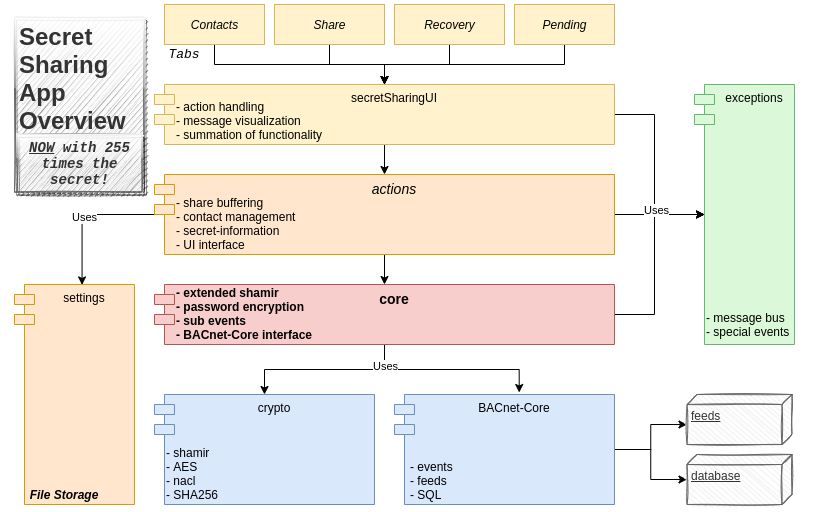

#readme.md
_____
### Usage

***+++Important+++***

To bridge the BACnetCore we need to generate a masterfeed and feeds first.
At present this is done with the feed_control module:
```
* python3 feed_control.py ui
```
Then we can use the sneakernet to load onto a drive.
```
* python3 guiSneakernetpy
```
***Again*** we launch the feed_control to subscribe to wanted feeds.

To run the Application we run the secretSharingUI module. 
```
* python3 secretSharingUI.py
```
At the first usage a register is prompted where a username, and a password is needed.
As soon as the password is set it will be prompted at 
a restart of the module. Furthermore, an encryption of critical generated files is now possible
by running the fencrypt module: 
```
* python3 fencrypt.py -pw 'password'
```
Now a folder should have been created with files for the secret sharing application.
The Application state will be saved at exit. It is also possible to extend the application
with a Saver-Daemon for regular auto-save, more in the actions module. <- (Not in UI yet)
It is vital to conclude your session before making use of fencrypt, or we expect
unknown behaviour. 

In the UI it should be generally clear what actions to take. The Update Button is used to
handle new events from the database as well as automatic replies to others share requests.
The only burden on the user is to share their own secrets by either typing or loading a file into
the UI, choosing targets and numbers for shares and threshold and clicking the sharing button.

Update will also automatically recover returned secrets if possible and inform the user of their return,
but return has to be manually initiated in the recovery tab.


### Module structure and imports.


To make use of core functionality the vital package is the core module which sits in the BackEnd Package.
It can be imported without generating files or any oder side-effects. For an extension of the application please
make use of the documentation and message channels implemented to-date. 