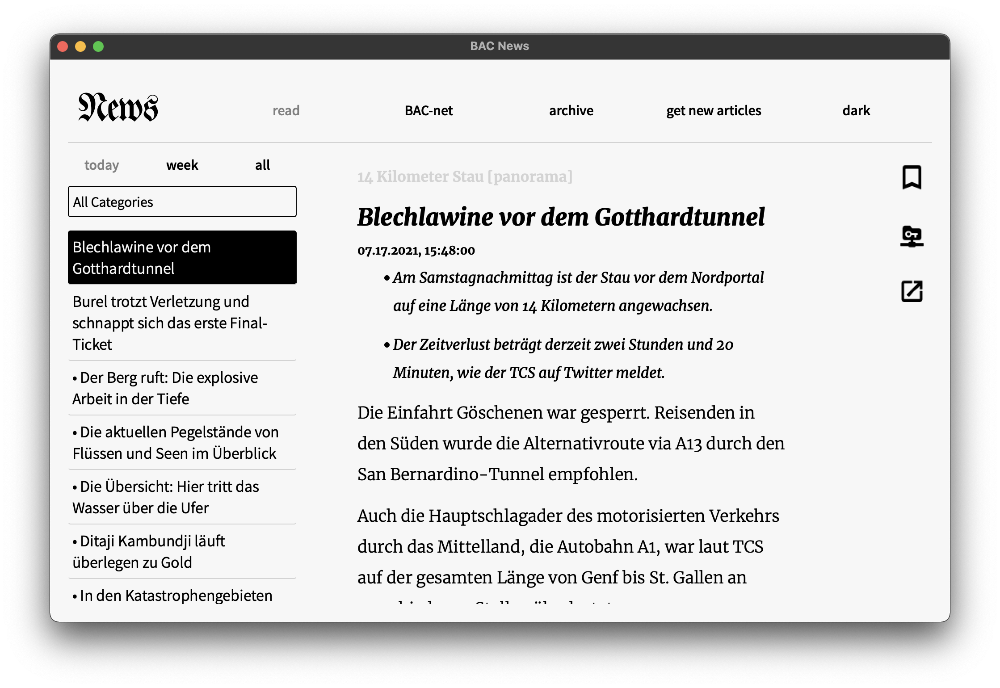

# A newsreader for the BAC-net

Easily download articles from SRF and share them with other users via LAN, Bluetooth or BAC-net.

The easiest way to use the application is by using poetry (https://python-poetry.org/).
Once installed, run "poetry install" in the root directory of the project. 
Now the program can easily be run by executing "poetry run python app/runner.py".
Of course, it is also possible to install all the dependencies using pip.

## POSSIBLE IMPROVEMENTS
- [ ] fix bookmark color in dark mode
- [ ] improve article category filter efficiency
- [ ] improve bluetooth functionality on linux and windows
- [ ] add bluetooth support for mac
- [ ] add mechanism for detecting if user altered article 
