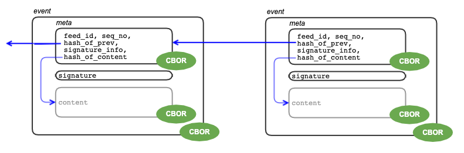

# BACnet Event Structure

BACnet __feeds__ are append-only logs implemented as a sequence of
__events__ that are chained via hash values.



An __event__ has three elements: a meta header, a signature and
the optional content, each of them being represented as an array of
bytes. The byte array of the signature contains the actual signature
value. The bytes for the header and the optional content elements
contain a CBOR-encoded data structure. In the case of the meta header,
this data structure has 5 fields. The content's internal structure is
undefined and can be set by applications as they like.

The __meta__ header is the most important part of an event as it
identifies to which feed an event belongs (feed_id), the position in the
feed (seq_no), a hash value computed over the previous event's meta
header bytes, signature information (which algorithm was used to
compute the cryptographic signature), and a hash value computed over
the content's CBOR-encoded bytes.

The array of three elements, which make up an event, are encoded
according to the CBOR standard, too. Overall, such an event data
packet can be sent to a peer independently from the rest of the
append-only log.

The following grammar is another way of describing the event data structure:

```
event data structure (="log entry") in grammar form and as ASCII art:

  +-event------------------------------------------------------------------+
  | +-meta---------------------------------------+                         |
  | | feed_id, seq_no, h_prev, sign_info, h_cont |, signature, opt_content |
  | +--------------------------------------------+                         |
  +------------------------------------------------------------------------+

  event :== _cbor( [ meta, signature, opt_content ] )

  meta  :== _cbor( [ feed_id, seq_no, h_prev, sign_info, h_cont ] )

  h_prev         :== [hash_info, "hash value of prev event's meta field"]
  signature      :== "signature of meta"
  h_cont         :== [hash_info, "hash value of opt_content"]

  sign_info:     enum (0=ed25519)
  hash_info:     enum (0=sha256)

  opt_content    :== _cbor( data )
  
```

# The use of CBOR

CBOR (see RFC 7049) is a serialization format for structured data
types. In Python, serializing is achieved via the ```dumps``` method,
and deserialization with ```loads```. A simple example:

```python
import cbor2

pkt = cbor2.dumps([123,'and a string'])
print( cbor2.loads(pkt) )
```

All major programming languages have libaries which provide CBOR
functionality.


## Why (three times) CBOR?

The event's three elements have variable length, wherefore a fixed
packet layout does not work. At the outer level, CBOR is used to map
the array of three elements to an array of bytes.

There are two reasons to use CBOR _inside_ the event data structure,
too. The first is that shipping the meta header as bytes removes any
ambiguity how the header's fields have to be arranged for computing
the signature: the signature is computed over the bytes exactly as
they are shipped inside the event's outer data structure. The second
use of CBOR inside an event's data structure is for the content
element where serialization makes sure that _any_ data structure can
be sent as content, starting from integer to string, array,
dictionary, any recursions thereof, and even the value Null (None).
Also here, having the (encoded) content bytes available as an element
removes any ambuguity how to compute the hash value over the content,
both for the sender as well as the verifying receiver.


## Why is the content element optional?

An append-only log has the property of being an immutable data
structure: the use of a cryptographic hash function, together with the
chaining, guarantees that past events cannot be modified (without
breaking the chain). However, it can happen that some content MUST be
deleted e.g., if law enforcement requires the removal of improper
material. Only storing the content's hash value permits to do exactly
this: The content becomes so-called "off-chain content" that can be
removed without invalidating the hash chain. This is also the reason
why the chaining is done across the internal meta headers, instead of
the outer event packet. Receiving an event packet that has no content
element is thus a valid operation. If off-chain content was removed
because of storage or bandwidth limitation, it is always possible to
transfer such a content piece via other means and then later verify
(by computing the hash over it) that this _is_ the content piece that
was referenced in the meta header.


## Algorithm agility

Hash algorithms become weak over time because of scientific progress
and/or increase in compute power and storage. MD5 should not be used
anymore and SHA1 is also expired nowadays. In order to prepare for the
replacement of the currently used SHA256 hash algorithm, without
having to define a new event data structure, we use "hash pointers"
in form of a tuple that contains an algorithm identifiers (small integer)
as well as the hash value itself.

Algorithm agility is also needed for the signature for the same reason
as above, but also for supporting different device classes. Currently,
ED25519 signing and signature verification are too CPU-intensive for
embedded devices. In order to include Internet-of-Things (IoT) devices
in a BACnet, we envisage a second signing algorithm called "keyed
hashing". The drawback of using e.g., HMAC_SHA256 keyed hashing is
that it is based on a shared secret, while ED25519 is a public key
algorithm. Nevertheless, using the ```signature_info``` field we can
flag which signing schema was used. Note that this field must be part
of the signed data (namely the meta header) instead of the signature
element, in order to be protected against tampering.


## A Convention for Content Types

The event data structure is agnostic about the content's internal
structure. However, all BACnet applications make use of the content
element, which could lead to confusion: is that integer a sensor
temperatur reading or just a posted message inside a chat? In order to
demultiplex an event towards the application it belongs to, we need some
rules how applications can "tag" their content.

We suggest to use the following convention that involves three aspects:

```
opt_content :== _cbor( [ 'app_name/verb', parameter ] )
```

The ```app_name``` indentifies the application that should process
such an event.  The ```verb``` is used by the app to signal the
meaning of the folllwing ```parameter```.

Some speaking examples:

```
['chat/post', {'text': 'Hi Alice, nice to hear from you",
               'in-reply-to': '5b60d1ff04d8958917d7eab32b...',
               'timestamp': 1585201899}
]
```

```
['alias/define',   {'type': 'feed',
                    'key': 'eab32b86d62f72...',
                    'value': 'Alice'}
]
```

```
['alias/undefine', {'type': 'feed',
                    'key': 'eab32b86d62f72...'}
]
```

```
['chess/invite', {'invitee': 'eab32b86d62f72...'}]
['chess/accept', {'game_id': 'ee3fbfbf43354674ca4...'}]
['chess/move', {'game_id': 'ee3fbfbf43354674ca4...',
                'in-reply-to': 'b99b026a699505...',
                'move': '18. Bxe5'}
]
```

---
