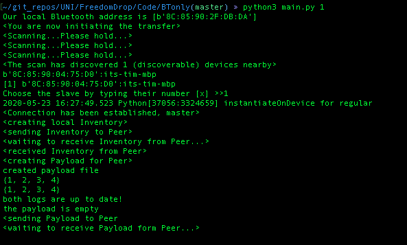
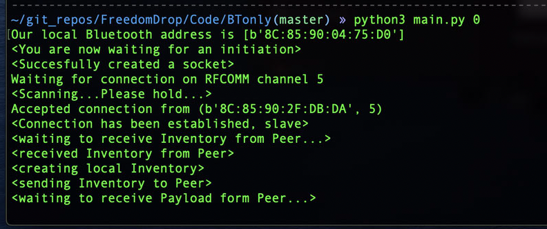
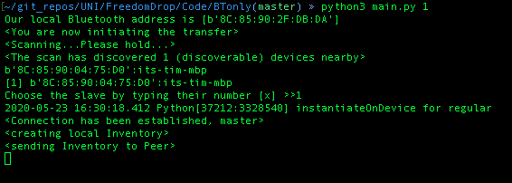
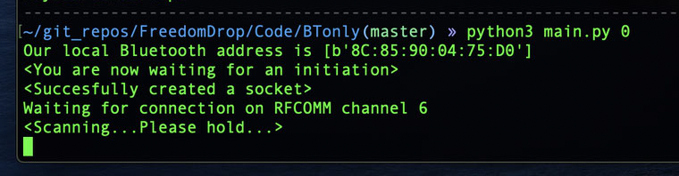

# Demo - Gruppe 1 Dev2Dev
## Anforderungen
* MacOS 10.15 Catalina 
* cbor2 (pip3 install cbor2)
* pybluez 0.30 build by tigerking on Github ( https://github.com/tigerking/pybluez/releases )

## Steps to reproduce 
Directory: https://github.com/cn-uofbasel/BACnet/tree/master/groups/01-dev2dev/Code/demo
1. Client2 starten mit `python3 main.py 0` um auffindbar zu sein. Der RFCOMM Kanal wird auch ausgegeben 
2. Client1 starten mit `python3 main.py 1` um die Suche nach Geräten zu starten.
3. Warten bis Client1 ein Gerät gefunden hat. In der Liste der Geräte dann das passende Gerät auswählen.
4. Sobald sich die Geräte verbunden sind wird das komplette Programm mit Austausch der Logs abgesprult. 

## Gewünschtes Ergebnis 
für Client1:

für Client2:

## ungewünschtes Ergebnis 
für Client1:

für Client2:
