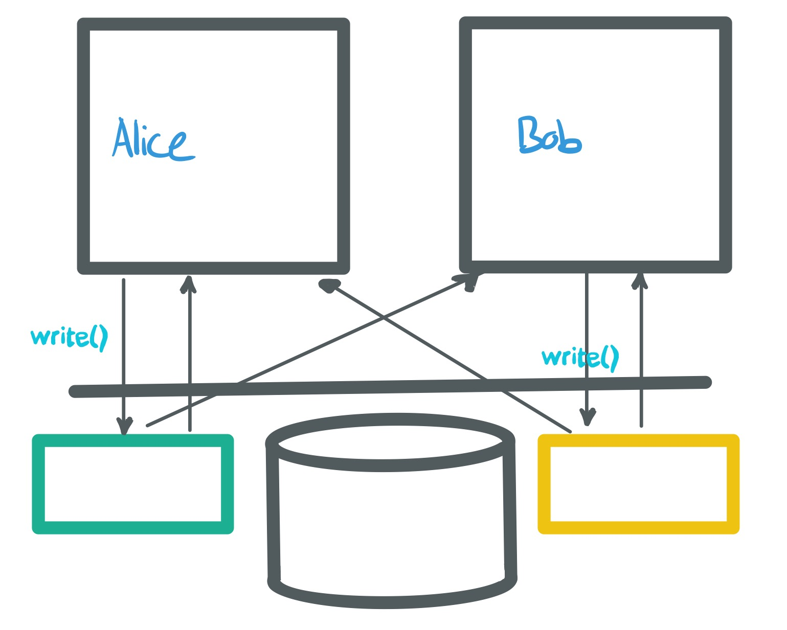
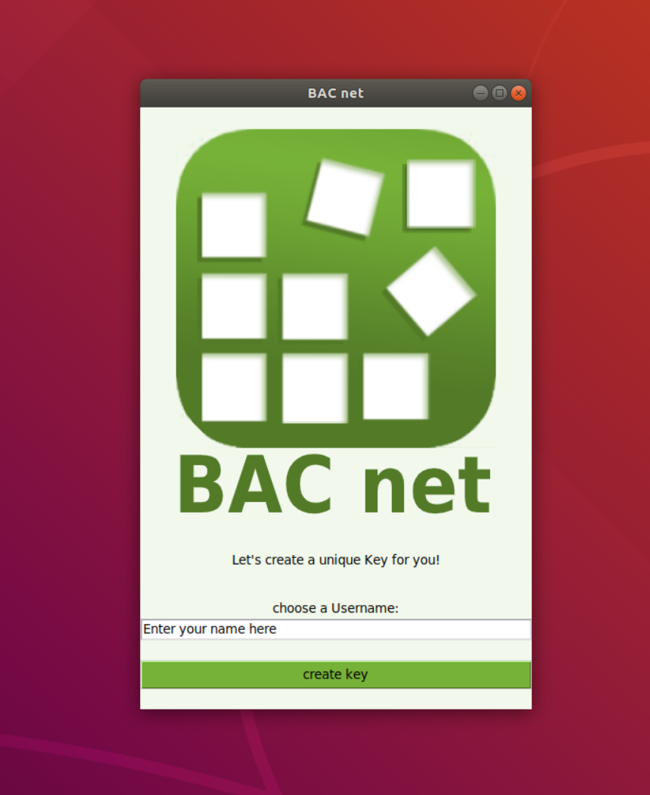
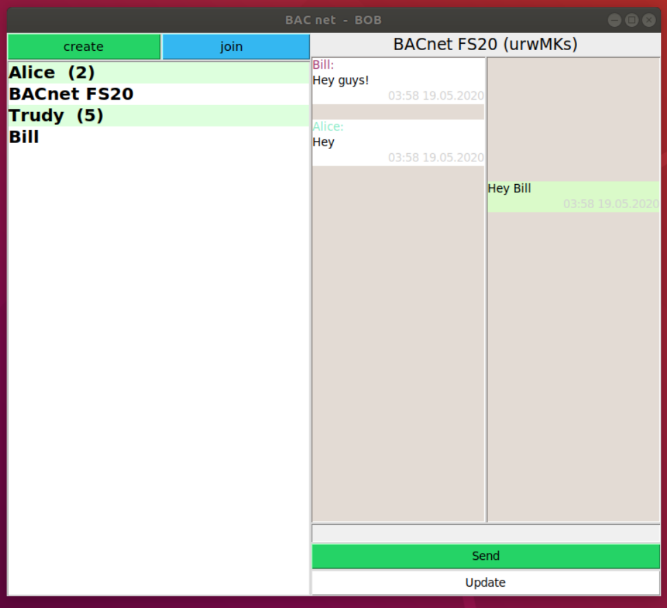
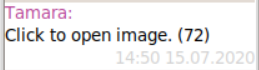

# I&S Security Gruppe 03_SubChat

> Our Group is creating user interface for a chat. The user interface has to be intuitive and should integrate the data given to us foremost by group 07. Since the creation of a User Interface is our main objective, it's intuitiveness is of critical importance to us

## Content
1. [Prototype](#Prototype)
    1. [Structure](#Structure)
    2. [Nice-to-know](#Nice_To_Know)
2. [Final Version](#Final_Version)
    1. [Prerequisites](#Prerequisites)
    2. [How to use the app](#How_To)
3. [Protocols](#Protocols)
4. [Links](#Links)

## Prototype
### Structure
The following image explains, how the code is structured

The Prototype is making use of the demo files (BACnet/src/demo/lib). They have been modified to take inputs from methods (instead of the command line as they were indended to).

### Nice_To_Know
How to use the demo files to create entries:

> ./crypto.py >alice.key
> ./feed.py --keyfile alice.key alice.pcap create
> 	["write entries like this!"]
> ./feed.py alice.pcap dump
> 
> 
> ./feed.py --keyfile alice.key alice.pcap append
> 	['write entries like this!']

## Final_Version
### Prerequisites 
We had two options to build our User Interface: JavaFX and Python's TkInter. Even though TkInter is much more limited in its functionality if we compare it to our first choice JavaFX, we decided us for TkInter for better integrity with the other groups code. 
We also have other modules which has to be installed on your OS before you can use it. The [links](#Links) to the modules we used are at the end of this README-file. 
Short and sweet for Linux users; They can install the modules with these commands: 
> apt-get install python-tk

> apt install python3-pip

> pip install pickle-mixin

> pip install pyglet

> sudo apt-get install python3-pil python3-pil.imagetk

> pip install pybase64

After these modules are installed, you are ready to use our app.

Our application was built on top of the modules of other groups which is why we need to assume that the reader knows how to use them in order to be able to start and communicate without any problems. 

The prerequisite to start our application is to start the application of group 14. We won't comment on how to use it since that's already discussed in the documentation of group 14. 

Now we're good to go and can start our application.

### How to use the app

Go to the "SubjectiveChat"-folder and open the terminal. From there you can start the python-file "app.py". The login-window should pop up:

Here you can choose your username (must have max. 16 letters) and your personal key file will be created and the main windows comes. 
_Important: The login windows only pops out if you haven't logged in yet._

On the upper-left there is a Bar with two buttons: 

Example of creating a chat: 

Here you can choose between a private chat and a group chat.

In case you want to create a group chat you can enter a group name (max. 16 letters). Otherwise you will get a chatID which you can confirm. 

Example of joining a chat:

Here you can type in the chatID, which you can get from your chatpartner (who created the chat). 
If the chatID is valid you can chat now.

Example of group chat:

If you wish you can also send images and pdfs. The files will be splitted and sent in little (1 KB) parts, so all merge/network-methods of the other groups (e.g. Lora) are supported. But we restricted the file size to 100 KB anyways, so the app is definitely not overloaded. 

To send images or pdfs you can type in the message the filetype and path into the message field:

> filetyp(img/pdf): path

Examples: 

> img: /home/cn/Desktop/example.jpg (also other formats supported)

> pdf: /home/cn/Desktop/doc.pdf

The message looks then like that: 

To see the image / pdf you just have to click on the message. Then the file (either a pdf or an image) is opened with the correct viewer.

## Protocols

Protocols from meeting can be found in 'protocols/'.

## Links

[Tkinter](https://docs.python.org/2/library/tkinter.html)
[PIP](https://pypi.org/project/pip/)
[Pickle](https://docs.python.org/3/library/pickle.html)
[Pyglet](https://pypi.org/project/pyglet/)
[Pillow](https://pypi.org/project/Pillow/)
[base64](https://docs.python.org/3/library/base64.html)

