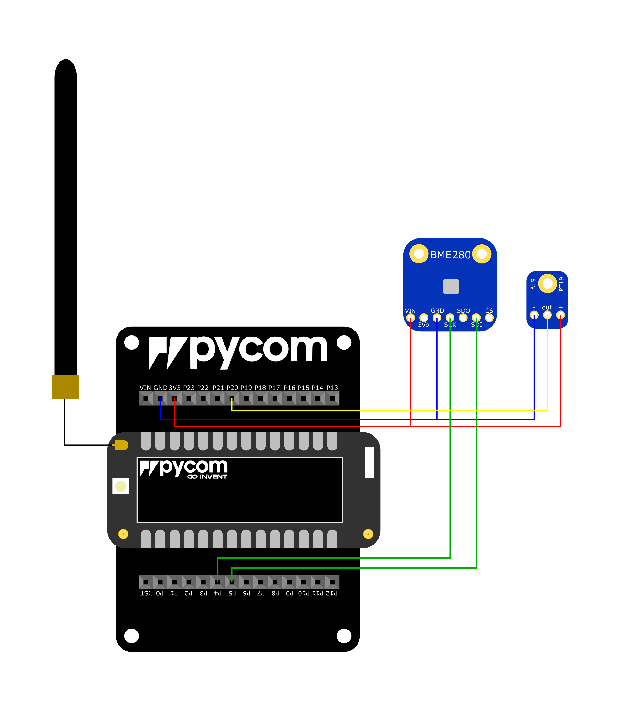

# LoRaSense
LoraSense gathers weather data such as temperature, air pressure, humidity and light intensity and sends this information through the long range wide area network.
## Overview
1. [Idea](#idea)
2. [Hardware Specification](#hwspec)
3. [API](#api)
## Idea<a name="idea"></a>
For the realization of this project, at least two LoPy<sup>4</sup> complete with an Expansion Board v3.1 each are required.
One node serves as the receiver of data and collects the information of the other LoPy<sup>4</sup> and forwards it to a computer via UDP. This project is scalable such that multiple node can communicate with the receiver.

## Hardware Specification<a name="hwspec"></a>
### Minimal Required Hardware
- Two Pycom LoPy<sup>4</sup>
- Two Pycom Expansion Boards v3.1
- One BME280 Sensor with I<sup>2</sup>C capabilities (since the board and the chip are connected via a I<sup>2</sup>C bus).
- One ALS-PT19 Analog Light Sensor Breakout
### Connecting the Sensors

- The 3V3-pin of the board must connect to the VIN-pin and th of the BME280-chip and the +(plus)-pin of the ALS-chip.
- The GND-pin of the board must connect to the GND-pin and the SDO-pin of the BME280-chip and the -(minus)-pin of the ALS-chip.
- The P3-pin of the board can connect to the SDI-pin of the BME280-chip (the SDA-pin of the board can be specified however, P3 is the default choice).
- The P4-pin of the board can connect to the SCK-pin of the BME280-chip (the SCL-pin of the board can be specified however, P4 is the default choice).
- The P20-pin of the board can connect to the out-pin of the ALS-chip (the ALS-pin of the board can be specified however, P20 is the default choice).
- The antenna must be connected to the 868/915 MHZ LoRa/Sigfox antenna port.

## API<a name="api"></a>
<ins>Note: <em>bme280.py</em> and <em>lorasense.py</em> must be located in the same folder.</ins>
Assuming that <em>lorasense.py</em> is stored in the lib-folder, it must first be imported.
```python
import lib.lorasense as lorasense
```
### Starting the Module
To start the module, simply use
```python
lorasense = lorasense.LoraSense(sda="P3", scl="P4", als="P20", frequency=1, mode=0)
```
All these parameters are presets and can be altered at will.
- ```sda``` specifies the pin for the serial data from the BME280.
- ```scl``` specifies the pin for the serial clock from the BME280.
- ```als``` specifies the pin for the influx from the ALS.
- ```frequency``` determines how often data should be send.
- ```mode``` can be either 0 or 1. If the LoPy<sup>4</sup> is connected to the sensors, use mode 0, if the node is a receiver, use mode 1.
### Set up LoRa-Connection
To set up the LoRa-connection, use
```python
lorasense.setupLoRa(mode=LoRa.LORA, region=LoRa.EU868, tx_power=14, sf=7)
```
These parameters are also presets and can be changed.
<ins>Note: It is recommended to use the presets of this method.</ins>
- ```mode``` specifies the type of connection.
- ```region``` specifies the frequency.
- ```tx_power``` specifies the transmission power.
- ```sf``` specifies the spreading factor of the transmission.
### Set up WLAN-Connection
For the LoPy<sup>4</sup> to establish a WLAN-connection use
```python
lorasense.setupWLAN(ssid, pw)
```
There parameters are required to be input by the user in order to function.
- ```ssid``` is the name of the WLAN.
- ```pw``` is the password of the WLAN.
### Send Data through LoRa
<ins>Note: In order to send data make sure ```lorasense``` was initiated in ```mode=0```.</ins>
To start sending information from the LoPy<sup>4</sup> simply use
``````
lorasense.startSendInfo()
``````
### Receive Data through LoRa
To start receiving information use
``````
lorasense.startGetInfo()
``````
### Examples
The LoPy<sup>4</sup> with the sensors connected to the default pins can be started with this bit of code:
```python
import lib.lorasense as lorasense

lorasense = lorasense.LoraSense(mode=0)
lorasense.setupLoRa()
lorasense.startSendInfo()
```
The receiver LoPy<sup>4</sup> only needs to run the following code to receive data:
```python
import lib.lorasense as lorasense

lorasense = lorasense.LoraSense(mode=1)
lorasense.setupLoRa()
lorasense.startGetInfo()
```