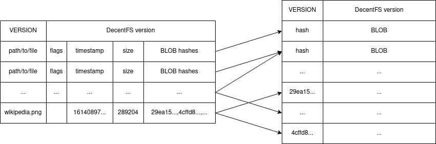

# DecentFS

The DecentFS is a file system build on the top of BACnet append only log.

## Structure

The file system consists of two files, one holding the meta data and the other holding the content. The metadata entries can reference multiple content entries. The content log is only required to retrieve the content of a file. This allows faster operations on files that do not require access to the content and deduplication of equal content.

Due the nature of append only logs, obsolete entries cannot be updated or deleted. Each modification is append at the end of the log. DecentFS has to sequentially scan the entire metadata log to evaluate the current status of a path. The last entry of a path in the log defines the current status.

For the content log the order of entries does not matter.
Each entry in the content log must be referenced by at least one entry in the metadata log (1-n or 1-many relation).

The entries in the log files are stored as [cbor2](https://github.com/agronholm/cbor2) serialized list objects.
The first entry of both log files may contain metadata about the file system itself to maintain compatibility and migrations.

The left table represents a metadata log file, the right table a content log file.
Each row represents an entry and each column the objects it holds.
The arrows visualize the relation from metadata to content entries.

### metadata log

A metadata entry consists of 5 fields.

#### path

This must contain a POSIX pathname.

#### flags

This field is reserved for various flags or file attributes.

Flags can be used to mark a path as removed or highlight special files like symlinks and directories that may not reference any content hashes themselves.
Flags can also be used to implement additional features like compression, encryption, snapshots etc.

Currently known flags:
 - `R`: removed path, can't be combined with other flags

#### timestamp

This contains a POSIX like timestamp in nanoseconds, usually the time of creation.

#### size

This contains the file size in bytes (sum of the length of all referenced BLOBs).

#### hashes

This contains a serialized list of hashes. Each hash must have a corresponding entry in the content log.
The order of the hashes is the order in which the BLOB have to be combined to read the file.

### content log

A content entry is a simple tuple.
To avoid duplication each entry should be unique.

#### hash

Hash of the BLOB. The current version uses the [BLAKE2b](https://www.blake2.net/) function.

#### BLOB

The actual (binary) content of the block.

## Performance hints

The logs are scanned sequentially from the first to the last entry. This can be a performance penalty for large logs. However, some mitigation approaches exist.

### Never read BLOBs unless required

The content log tends to be much larger that the metadata log. Even when searching for hashes it's faster to loop over all metadata entries than loading the content log with all BLOBs.

### Buffer size

The buffer size defines the maximum size of a BLOB field. If a file is larger than the buffer, it's split into multiple buffers (aka. blocks or slices). A large buffer size enhances the performance for large files but reduces the effect of deduplication. A small buffer size has a better chance to find duplicated slices, but produces more hashes in the metadata log and therefore a potentially higher fragmentation in the content log.
Changing the buffer size of an existing DecentFS might be possible, but resets deduplication.

### Exploit sequential writes

The slices of large files should be written sequentially to the content log. When reading the BLOBs, a cursor can be used to continue reading from the first matching hash in the content log instead of restarting from the first entry for every hash.
Note that due deduplication it's not guaranteed to find all hashes in sequential order. When reaching the end, the cursor needs to be reset to the first entry to scan the remaining entries. But even then, there is still a good chance that the remaining hashes are again in a sequential order. In the worst case, the hashes are distributed randomly or in reverse order in the content log.

## API

This draft is inspired by Hyperdrive.

### `VERSION`

API version
Might be used to check compatibility with the file system version

### `def __init__(self, myDecentFs, key, opt="")`

open existing file system

option: read-only

### `def __init__(self, key, opt="")`

create new file system

option: read-only

### `def __del__(self)`

close gracefully and cleanup

### `def open(name, opt="")`

open and return file descriptor

option: read-only

### `def read(fd, buffer, offset, length, position)`

read from file descriptor and return content

### `def write(fd, buffer, offset, length, position)`

write to file descriptor

### `def close(fd)`

close file descriptor

### `def symlink(target, name)`

create symlink

### `def unlink(name)`

remove file or symlink

### `def mkdir(name, opt="")`

create directory

option: recursively

### `def rmdir(name, opt="")`

remove directory

option: recursively

### `def readdir(name, opt="")`

list files in directory

option: recursively

### `def stat(name, opt="")`

get various information about a file or directory

## Glossary

### buffers, blocks, slices

Large files can be split into this smaller parts.

### feed, log

Append only log

### entry

A single event in the append only log

### metadata log, metafeed

Append only log containing meta data of files and paths.

### blobfeed, content log

Append only log containing content of files and paths.
